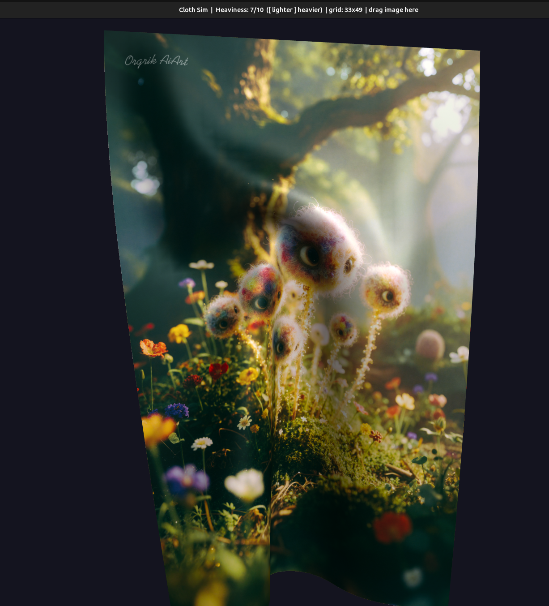

<div align="center">
  
  <h1>🧵 Cloth Simulator</h1>
  <p>
    <strong>Real-time interactive cloth simulation</strong><br/>
    C++20 · SDL2 · OpenGL 4.1 · Verlet Integration
  </p>
  <p>
    
    
    
    
    
  </p>
</div>

---

## ✨ Features

- **Realistic physics** — Verlet integration with structural, shear, and bend constraints
- **Heavy fabric feel** — tunable damping from light chiffon to heavy velvet (`[` / `]` keys)
- **Mouse interaction** — grab and drag any point on the cloth with realistic velocity transfer
- **3D camera** — orbit with right mouse drag, zoom with scroll wheel
- **Texture mapping** — drag & drop any image onto the window to apply as texture
- **Self-collision** — cloth pushes through itself with spatial-hash broadphase
- **Dynamic wind** — multi-frequency noise for natural ambient motion
- **Fixed timestep** — physics decoupled from framerate via accumulator

## 🎮 Controls

| Input | Action |
|-------|--------|
| Left mouse drag | Grab and pull cloth |
| Right mouse drag | Orbit camera |
| Mouse wheel | Zoom in / out |
| `[` / `]` | Decrease / increase fabric heaviness |
| `R` | Reset cloth |
| Drag image file | Apply as texture |
| `Esc` | Quit |

## ⚙️ How It Works

### Particle System
Each point on the cloth is a `Particle` with position, previous position (for Verlet), and accumulated forces. The Verlet integration step:

```
new_pos = pos + (pos - prev_pos) × damping + acc × dt²
```

### Constraints
Three constraint types maintain fabric structure:
- **Structural** — horizontal & vertical neighbors
- **Shear** — diagonal neighbors (prevents shearing)
- **Bend** — skip-one neighbors (resists folding)

Constraints are solved iteratively (8 iterations × 8 substeps per frame).

### Self-Collision
A spatial hash grid (`std::unordered_map` with 3D cell key) provides O(n) broadphase collision detection. Connected structural neighbors are excluded from collision pairs.

## 🏗️ Project Structure

```
cloth_sim/
├── CMakeLists.txt
├── external/
│   └── stb_image.h
├── shaders/
│   ├── vertex.glsl
│   └── fragment.glsl
└── src/
    ├── main.cpp         — Entry point, game loop, event handling
    ├── cloth.h / .cpp   — Cloth grid, constraints, physics, self-collision
    ├── particle.h       — Particle struct with Verlet integration
    ├── renderer.h / .cpp — OpenGL VAO/VBO/shader/texture management
    ├── interaction.h / .cpp — Mouse raycasting & drag handling
    └── camera.h         — Orbital camera with ray generation
```

## 🔧 Build

### Dependencies
```bash
sudo apt install libsdl2-dev libglm-dev libglew-dev
```
Download [`stb_image.h`](https://github.com/nothings/stb/blob/master/stb_image.h) into `external/`.

### Build & Run
```bash
mkdir build && cd build
cmake .. -DCMAKE_BUILD_TYPE=Release
make -j$(nproc)
./cloth_sim          # starts with checkerboard texture
./cloth_sim flag.png # starts with custom texture
```

### Runtime texture loading
Drag any image file (PNG, JPG, etc.) onto the window to swap textures instantly.

## 🧪 Tuning

Key parameters in `cloth.h` for fine-tuning the fabric feel:

| Parameter | Default | Effect |
|-----------|---------|--------|
| `SPACING` | 0.05 | Grid resolution |
| `GRAVITY_SCALE` | 12.0 | Gravity multiplier |
| `CONSTRAINT_ITERS` | 8 | Solver iterations per substep |
| `PARTICLE_MASS` | 1.0 | Per-particle mass |

Runtime heaviness (`[` / `]`) maps to an exponential damping scale from `0.9999` (light) to `0.9940` (heavy).

## 📸 Screenshots

<p align="center">
  
</p>

## 📄 License

MIT — feel free to use, modify, and share.
